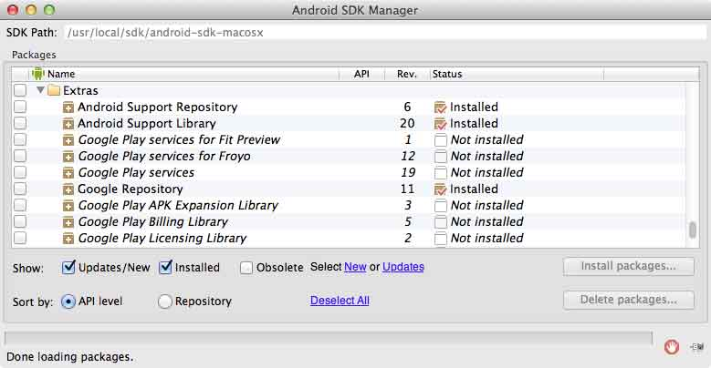

# About

This project was created to simplify the process of starting a IOIO project that supports running on Android and Console (as outlined in [Using IOIO With a PC](https://github.com/ytai/ioio/wiki/Using-IOIO-With-a-PC)).

Gradle is used to streamline the project setup process. The project can be imported into Eclipse using the [Gradle plugin](https://github.com/spring-projects/eclipse-integration-gradle) or can be built from the command line, for example, to build the Console application:

```bash
$ cd console
$ ../gradlew distZip
```

* ZIP file will be located in `build/distributions`.

Project is packaged with the IOIO library ([App-IOIO0504](https://github.com/ytai/ioio/wiki/Downloads#client-software-and-ioio-application-firmware-images)).


# Troubleshooting

## Gradle

If you have trouble importing the Gradle project into Eclipse because of errors related to the Android SDK not being found, you can try adding a `local.properties` file to the root of the project with the following contents:

```
sdk.dir=PATH_TO_ANDROID_SDK
```

Replace `PATH_TO_ANDROID_SDK` with the location where you have the Android SDK installed.


# Caveats

## Minimum Android SDK

When using a minimum Android SDK version < API 11 the Android Support Libraries need to be utilized. Unfortunately this caused errors related to resource not found `Theme.AppCompat.Light` when using Gradle to import the project.

If there is a need to target an Android SDK version < API 11 then the Android [Support Library](http://developer.android.com/tools/support-library/index.html) page should be consulted and the appropriate support library dependencies configured in the root project's `build.gradle` file. Also check that the necessary packages are installed in the Android SDK Manager:


